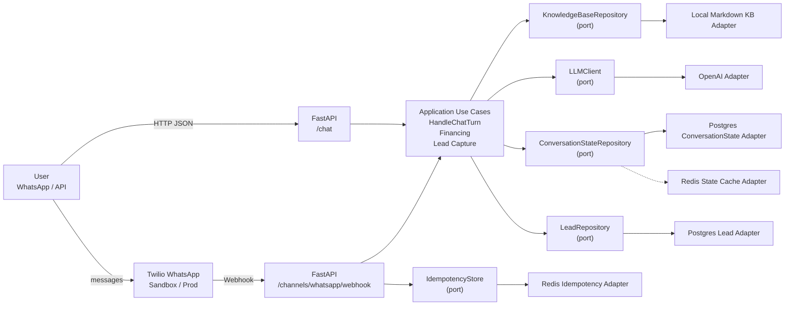
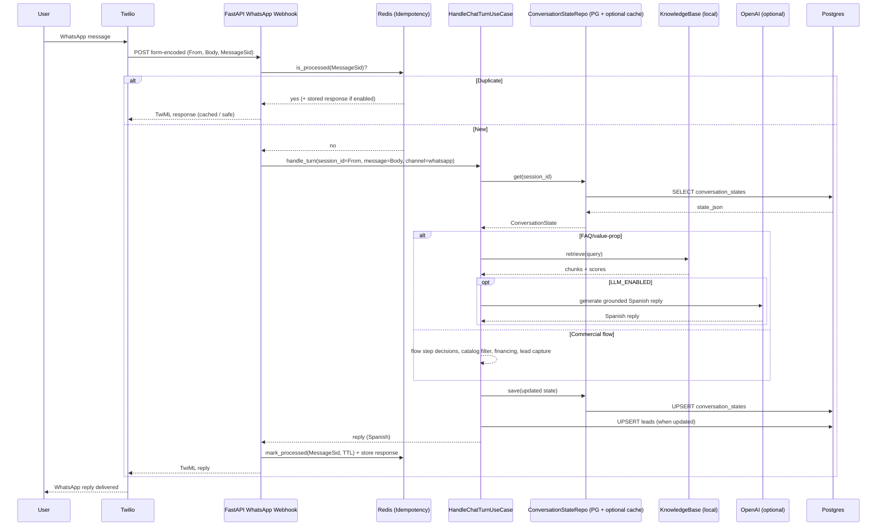
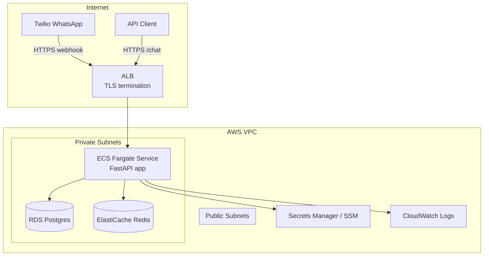

# ROADMAP_AND_BACKLOG

This document describes how to take the **Kavak AI Sales Agent** from the current MVP to a production-grade system. It consolidates architecture decisions, an execution roadmap/backlog, evaluation strategy, and a reference AWS target architecture.

## Other project docs

- **README:** [`README.md`](README.md)
- **Agent Contract:** [`docs/AGENT_CONTRACT.md`](docs/AGENT_CONTRACT.md)
- **Demo Guide (3 minutes):** [`docs/DEMO.md`](docs/DEMO.md)
- **Terraform Infrastructure:** [`infra/terraform/README.md`](infra/terraform/README.md) – Reproducible AWS infrastructure defined with Terraform, including networking, compute, persistence, caching, and HTTPS setup.

---

## Current MVP Architecture Decisions

### Clean Architecture and Ports & Adapters
The system follows Clean Architecture with strict separation of concerns:

- **Application layer** owns all business logic (commercial flow, financing, lead capture, state transitions).
- **Ports** define contracts for external dependencies (LLM client, repositories, retrieval).
- **Adapters** implement those contracts (Twilio inbound, OpenAI, Postgres, Redis, CSV catalog, local RAG).
- **Infrastructure** wires dependencies and runtime configuration.

This structure enables deterministic testing, clear ownership of business rules, and safe replacement of infrastructure components.

---

### Feature Flags as First-Class Design Elements
Key capabilities are controlled via explicit feature flags:

- `LLM_ENABLED`
- `TWILIO_IDEMPOTENCY_ENABLED`
- `CONVERSATION_STATE_REPOSITORY`
- `LEAD_REPOSITORY`
- `STATE_CACHE`

These flags are intentional architectural choices that allow:
- safe rollouts and fast rollback without redeploying code,
- controlled experimentation (e.g., enabling LLM only in staging),
- environment parity between local, staging, and production.

---

### LLM + RAG Boundary (Hallucination Control)
The LLM is treated strictly as a **language generation component**, not as a source of truth.

- All factual responses are grounded via RAG against a curated local knowledge base.
- If retrieval confidence is insufficient, the agent responds with a safe fallback.
- The LLM is fully optional and can be disabled via feature flag.

This design minimizes hallucination risk and keeps factual control in deterministic code.

---

### PostgreSQL and Redis Responsibilities
Data persistence and operational concerns are deliberately split:

- **PostgreSQL** is the source of truth for:
  - conversation state,
  - captured leads.
- **Redis** is used for:
  - Twilio webhook idempotency (MessageSid deduplication),
  - optional cache-aside for conversation state with TTL semantics.

This separation balances durability, performance, and operational safety.

---

### Minimal CI as a Quality Gate (GitHub Actions)
The project includes a **minimal but intentional CI pipeline** using GitHub Actions:

- **Code formatting and linting** are enforced to maintain consistency.
- **Automated test execution** (unit + golden tests) validates business logic and prevents regressions.
- CI runs on every pull request, acting as a lightweight quality gate.

This approach prioritizes:
- fast feedback cycles,
- reproducibility of results,
- confidence that architectural guarantees are preserved as the system evolves.

The CI is intentionally minimal to keep iteration speed high, while still protecting core business behavior.

---

## High-level components and architecture diagram (Mermaid)

---

## Runtime sequence: WhatsApp message end-to-end (Mermaid)

---

## How we would put this in production

### Production readiness checklist

- **HTTPS endpoint** for Twilio webhooks (TLS termination at the edge).
- **Secrets management** (OpenAI key, Twilio token, DB credentials).
- **Multi-instance scaling**: Postgres as truth + Redis idempotency avoids duplicate replies.
- **Observability**: structured logs with `session_id` + `turn_id`, plus metrics and alerting.
- **Safe rollout**: feature flags enable gradual activation (LLM, caching) and quick rollback.

---

## How to evaluate the agent (performance and quality)

### Business metrics (funnel)

- Flow completion rate: need → budget → options → financing → lead capture
- Lead capture completion rate (name + phone + preferred time)
- Handoff rate (next_action = `handoff_to_human`)

### Safety and correctness

- RAG retrieval hit rate for FAQ intents
- RAG fallback rate (should be low but non-zero; indicates safe behavior)
- “Grounding confidence” distribution (top score, chunks count)
- LLM failures and fallback success rate

### Operational reliability

- Latency p50/p95 for /chat and webhook
- Error rates (OpenAI, DB, Redis)
- Duplicate webhook rate and idempotency effectiveness

---

## How to prevent regressions

We combine three layers:

1) **Unit tests** for application logic (flow, financing, lead capture) and adapter contracts  
2) **Golden tests** (conversation snapshots) to lock expected behavior end-to-end  
3) **Release gates** in CI:
   - all tests + golden tests must pass,
   - coverage targets focused on application and critical adapters,
   - (later) offline scenario packs run against staging before release

Feature flags provide an additional “operational rollback” layer: disable LLM or cache without redeploy.

---

## Infrastructure as Code and Reproducible Deployments

A key architectural decision of this project is the use of **Terraform as the primary mechanism for defining and provisioning infrastructure**.

All production-oriented resources are described declaratively and versioned alongside the application code. This allows the system to be:

- **Reproducible**: any engineer can provision the same infrastructure using the same definitions.
- **Auditable**: infrastructure changes are visible through code review and version control.
- **Disposable**: environments can be created and destroyed safely (e.g., short-lived validation or demos).
- **Environment-consistent**: the same components are used across local, staging, and production, with differences expressed only through variables.

### Defined infrastructure components
Using Terraform, the project defines the following AWS components with minimal, cost-aware configurations:

- Virtual Private Cloud (VPC) with public and private subnets
- Internet Gateway and NAT Gateway for controlled outbound access
- Application Load Balancer (ALB) with HTTP → HTTPS redirection
- ACM-managed TLS certificates for secure webhook communication
- ECS Fargate service running the application container
- Amazon RDS (PostgreSQL) as the source of truth for state and leads
- Amazon ElastiCache (Redis) for idempotency and cache-aside behavior
- IAM roles and security groups with least-privilege access

All resources can be deployed using `terraform apply` and fully removed using `terraform destroy`, enabling safe experimentation without long-lived cloud costs.

### Alignment with production requirements
The Terraform setup mirrors real production needs:

- HTTPS endpoints required by Twilio webhooks
- Private networking for data stores
- Externalized configuration via environment variables and secrets
- Compatibility with feature flags to control behavior at runtime

While the current demo may use the Twilio WhatsApp Sandbox, the infrastructure itself is production-ready. Moving to a production WhatsApp sender would require configuration changes, not architectural changes.

For full details, see: [Terraform Infrastructure](infra/terraform/README.md)

---

## Roadmap and backlog

### Phase 1: Production hardening (P0)

- Strong webhook security defaults (signature validation on non-local)
- Idempotency always-on in production
- Rate limiting per sender (Redis)
- PII redaction in logs (phone masking)

### Phase 2: Evaluation & continuous improvement (P0/P1)

- Scenario packs + scoring rubric (offline evaluation harness)
- RAG quality monitoring (precision/recall style checks for KB updates)
- Better routing/intent detection (still bounded and testable)

### Phase 3: AWS deployment with Terraform (P1)

- Reproducible infrastructure:
  - ECS Fargate service (container)
  - ALB (HTTPS)
  - RDS Postgres
  - ElastiCache Redis
  - Secrets Manager / SSM
  - CloudWatch logs + alarms
- Staging environment identical to prod with smaller instance sizes
- CI/CD pipeline to build/push image and update ECS service

---

## Target AWS architecture (Mermaid)

---

## Notes

- WhatsApp Sandbox vs production sender does not change the webhook architecture; production readiness is mainly a deployment and compliance process.
- The current codebase decisions (flags, ports/adapters, idempotency) are designed to transition to production without redesign.
