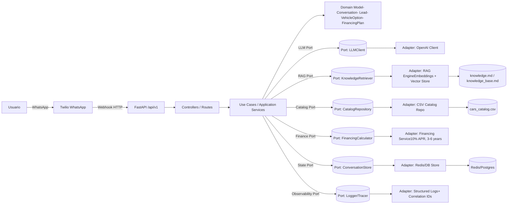

```mermaid
flowchart LR
  %% Channels
  U[Usuario] -->|WhatsApp| TW[Twilio WhatsApp]
  TW -->|Webhook HTTP| API[FastAPI /api/v1]

  %% App Core
  API --> CTRL[Controllers / Routes]
  CTRL --> UC[Use Cases / Application Services]

  %% Domain
  UC --> DOM[Domain Model- Conversation- Lead- VehicleOption- FinancingPlan]

  %% Ports
  UC -->|LLM Port| LLM_PORT[(Port: LLMClient)]
  UC -->|RAG Port| RAG_PORT[(Port: KnowledgeRetriever)]
  UC -->|Catalog Port| CAT_PORT[(Port: CatalogRepository)]
  UC -->|Finance Port| FIN_PORT[(Port: FinancingCalculator)]
  UC -->|State Port| STATE_PORT[(Port: ConversationStore)]
  UC -->|Observability Port| OBS_PORT[(Port: Logger/Tracer)]

  %% Adapters
  LLM_PORT --> LLM_ADAPTER[Adapter: OpenAI Client]
  RAG_PORT --> RAG_ADAPTER[Adapter: RAG EngineEmbeddings + Vector Store]
  CAT_PORT --> CAT_ADAPTER[Adapter: CSV Catalog Repo]
  FIN_PORT --> FIN_ADAPTER[Adapter: Financing Service10% APR, 3-6 years]
  STATE_PORT --> STATE_ADAPTER[Adapter: Redis/DB Store]
  OBS_PORT --> OBS_ADAPTER[Adapter: Structured Logs+ Correlation IDs]

  %% Data
  RAG_ADAPTER --> KB[(knowledge.md / knowledge_base.md)]
  CAT_ADAPTER --> CSV[(cars_catalog.csv)]
  STATE_ADAPTER --> DB[(Redis/Postgres)]
```